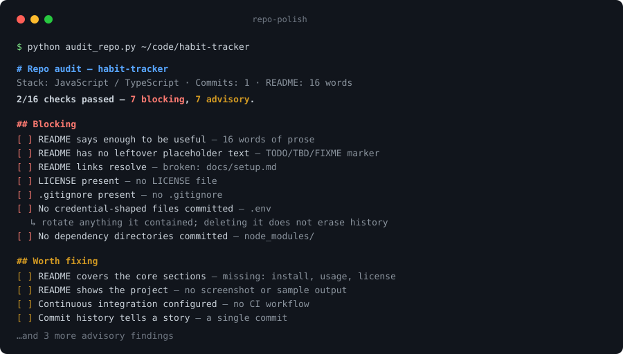

# repo-polish

A skill for Claude Code and Claude.ai that takes a repository from "works on
my machine" to something you would put at the top of a résumé — auditing what
is missing, then writing the README, badges, license, and repo metadata that
a stranger needs in their first thirty seconds.

[](https://github.com/mizisunet-dev/mom_ai/actions/workflows/ci.yml)
[](LICENSE)
[](skills/repo-polish/scripts/audit_repo.py)
[](skills/repo-polish/scripts/audit_repo.py)



## Why

Side projects are judged in about a minute, by someone who will never open the
source. They read the first screen of the README, glance at the file tree, and
decide whether this is a finished thing or an abandoned one. The code is
usually fine — the packaging is what fails.

Asking an assistant to "write me a README" produces confident, generic prose:
plausible install commands nobody ran, a feature list restating the title,
sometimes a green build badge on a repo with no CI. This skill fixes the
process instead of the prose. It grounds the work in an audit of what is
actually in the repo, insists that every claim be traceable to something in
the code, and treats an unverified command as a bug rather than a detail.

## Install

Requires Python 3.9+ for the audit script. No third-party packages.

```bash
git clone https://github.com/mizisunet-dev/mom_ai.git
```

Then make the skill visible to Claude by copying it into a skills directory —
`~/.claude/skills/` for every project, or `.claude/skills/` inside one repo:

```bash
mkdir -p ~/.claude/skills
cp -r mom_ai/skills/repo-polish ~/.claude/skills/
```

On Claude.ai, upload `skills/repo-polish` as a skill instead.

## Usage

Once installed the skill triggers on its own. Anything along these lines picks
it up:

```text
this repo is a mess, help me get it ready to show people
write a proper README for this project
I'm putting this on my GitHub for job applications — what's missing?
```

Claude then audits the repo, reads enough of the code to describe it honestly,
writes the documentation, and reports what it could not verify.

The audit also runs standalone — it is read-only, offline, and never edits
anything:

```console
$ python skills/repo-polish/scripts/audit_repo.py .
# Repo audit — mom_ai

**14/16 checks passed** — 0 blocking, 2 advisory.

## Worth fixing

- [ ] **Ecosystem is identifiable** — no recognised manifest
  ↳ Visitors work out how to run a project from its manifest. If there
    genuinely isn't one, say so explicitly in the README.
- [ ] **CONTRIBUTING guide** — none
  ↳ Only worth adding if you actually want outside contributions.
...
No blocking issues. Anything above is polish, not a stop-ship.
```

`--json` emits machine-readable output and `--strict` exits non-zero on
blocking failures, which is what this repository's own CI runs against itself:

```bash
python skills/repo-polish/scripts/audit_repo.py . --strict
```

## What it checks

Blocking problems are the ones that make a public repo look unfinished or leak
data — a missing README or LICENSE, committed `.env` files or `node_modules`,
leftover scaffold placeholders, README links pointing at files that do not
exist, oversized blobs. Advisory findings are the difference between a
repo that works and one that looks cared for: no CI, no tests, no screenshot,
a commit log that is thirty variations of "update".

The split matters because a checklist that treats everything as urgent gets
ignored. Full list of checks: [`scripts/audit_repo.py`](skills/repo-polish/scripts/audit_repo.py).

## Layout

```
skills/repo-polish/
├── SKILL.md                        the workflow Claude follows
├── references/
│   ├── readme-anatomy.md           what belongs in each section, by project type
│   └── badges.md                   badge recipes, and which ones are dishonest
├── assets/README.template.md       fill-in skeleton
└── scripts/audit_repo.py           the audit, stdlib-only
tests/test_audit_repo.py            end-to-end tests over throwaway repos
```

There is no package manifest, on purpose: a skill is plain files that get
copied into a skills directory, and the audit script imports nothing outside
the standard library.

The skill is loaded progressively: Claude reads
[`SKILL.md`](skills/repo-polish/SKILL.md) when it triggers, and pulls in
[`readme-anatomy.md`](skills/repo-polish/references/readme-anatomy.md) or
[`badges.md`](skills/repo-polish/references/badges.md) only when it reaches the
step that needs them. Additional skills can live alongside it under `skills/`.

## Development

```bash
python -m unittest discover -s tests -v
```

## Limitations

- The audit reads the working tree, not git history. It cannot tell you that a
  key was committed six months ago and later deleted — and that key is still
  exposed, so treat any secret that was ever pushed as burned.
- Link checking covers relative paths only. External URLs are left alone,
  deliberately: the script does no network I/O.
- Section detection is heading-based, so an unconventional README may be
  reported as missing sections it covers in prose.
- Fixing anything is Claude's job, not the script's. Run standalone, it only
  reports.

## License

MIT — see [LICENSE](LICENSE).
